# SJ Fitness

SJ Fitness is a website for a personal trainer owned gym located in West Wales. The site is aimed at fitness enthusiasts of all levels. The website will be used to attract new members to the gym and to enable the gym to receive new member enquiries at the client's desired tier/price point.

## Features 

### Existing Features

- __Navigation Bar__

  - This features on all pages and includes links to the gym's branding, Home page, Pricing page and Join Us page. The navigation bar is fully responsive and  is the same on each page to facilitate easy navigation.
  - The navigation bar will allow users to navigate the site on all devices without having to use the 'back' button. 

- __The Home/Landing Page__

  - The home/landing page contains a photograph of a person grabbing a barbell ready to lift it with the SJ Fitness motto of 'Better Starts Today' on a banner above. This motto is present to convey that the aim of the gym is to improve their fitness and engcourages the user to start their journey as soon as possible. 

- __The 'SJ Fitness Difference' Section__

  - This section highlights the gym's features to clients and/or prospective clients. The aim of this section is to entice new clients to the gym by showcasing its premium features in a clean and concise way.

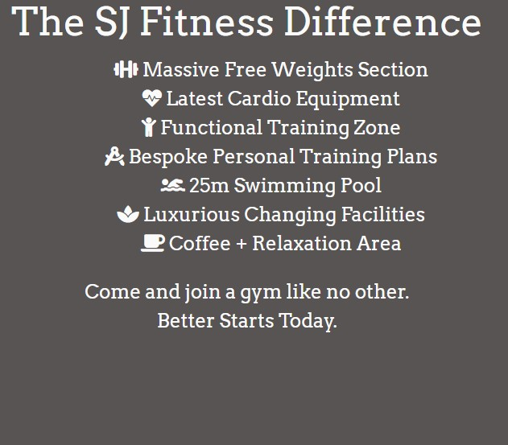

- __The 'How Can We Help You?' Section__

  - This section mentions numerous goals that clients may have in order to appeal to as wide an audience as possible. It leads on from the 'SJ Fitness Difference' section to highlight to clients and prospective clients that this is a gym for all abilities and all goals as opposed to only focussing on one type of training.

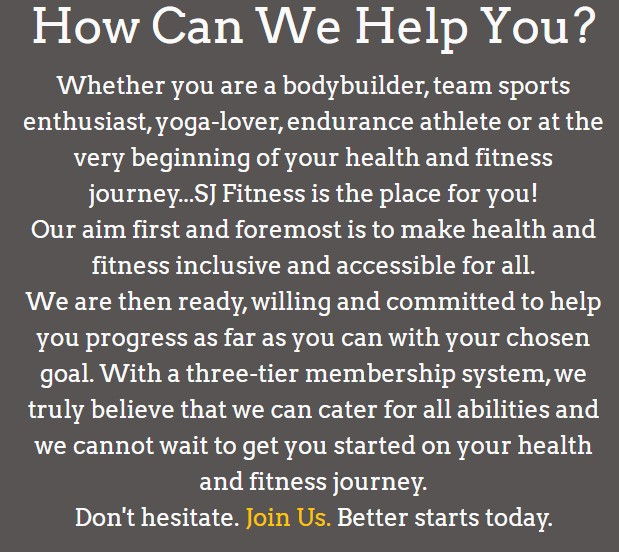

  - __The 'Find Us!' Section__

  - This section is a Google Maps snapshot to assist clients in finding the gym.

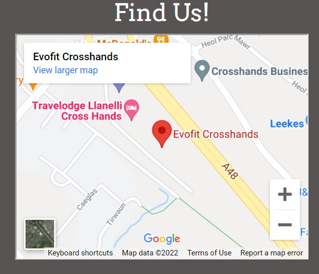

- __The Footer__ 

  - The footer section includes links to social media sites (facebook, twitter, instagram), and an email address to help potential clients get in contact with SJ Fitness. The social media links open to a new tab for easier navigation. 
  - The footer is valuable for the gym business as it allows prospective clients to follow them on social media and to get in touch about new memberships. It is also valuable for the user as it directs them to the social media sites and gives them an email point of contact to ask any questions prior to signing up via the 'Join Us' page.

- __The Pricing Page__

  - The pricing page has a brief explanation at the top of the page below the navigation bar which also contains a hyperlink to the Join Us page so that the user can immediately navigate to sign up.

  - The pricing page is then split into three columns which represents the different membership tiers and their respecting monthly cost. The information on different tiers is concisely summarised via the use of bullet points so that the user is not overloaded with too much information regarding the membership types.
  - The membership tiers and bullet points are positioned in such a way that it is clear to see what is omitted as the pricing tier decreases which makes comparison of membership tiers easier for the user. This is also a strategy to increase the gym's revenue by convincing prospective clients to sign up for the top tier as they can see that the top tier does provide more for their money when comparing membership options.

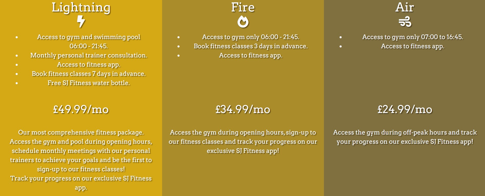

- __The Join Us Page__

  - This page will allow the user to join SJ Fitness. The user will be able select their desired membership type whilst also being asked to provide their full name and email address.

  - Below the Join Us form, there is a looped video of a group of people high fiving each other which is used to convey the fact that the client is joining a supportive community by joining SJ Fitness.

### Features Left to Implement

- A future feature to implement would be the embedding of fitness related videos which loop on all pages as opposed to the Join Us page only, a gallery to showcase people enjoying the experience of exercising at SJ Fitness and  timetable of classes so clients can plan their week of exercise.

## Testing
To view all testing documentation, please refer to [TESTING.md](TESTING.md)

### Screen Size Testing

#### Responsiveness
- X

#### Browser Compatibility
- X

- Chrome DevTools has been used to inspect the website. The window size has been responsively adjusted to inspect how the website performs at different screen sizes. The website works as planned as once the screen size goes beyond the breakpoint as defined by bootstrap for a medium sized device, any columns/page elements that would be adjacent to each other on a large screen stack on top of each other as desired.

### Validator Testing 

- HTML
  - No errors were returned on any page when passing through the official W3C Validator as shown in the links below.
  - [W3C Validator Home](https://validator.w3.org/nu/?doc=https://sniclasj.github.io/sj-fitness/index.html)
  - [W3C Validator Pricing](https://validator.w3.org/nu/?doc=https://sniclasj.github.io/sj-fitness/pricing.html)
  - [W3C Validator Join-Us](https://validator.w3.org/nu/?doc=https://sniclasj.github.io/sj-fitness/join-us.html)
  
  However, the following warnings were highlighted on the Home page and the Join-Us page due to the absence of a heading (h2 to h6) in a section in both instances.
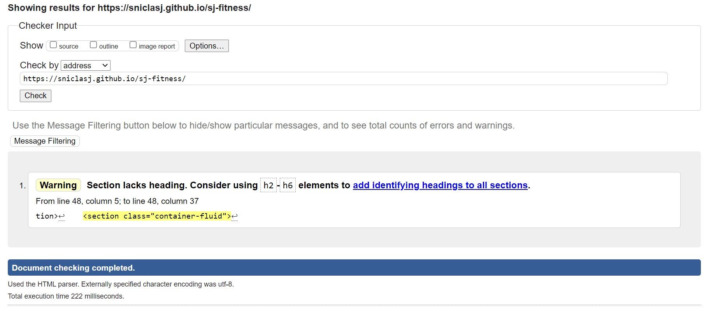
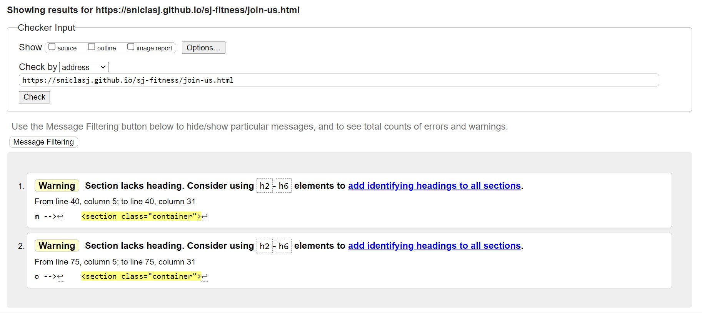
  - The Home page warning is related to the hero image section missing a h2 to h6 heading. The reason for this is that the section is specifically there to create the space for the 'hero-image' on the home page therefore a heading would not be suitable in this instance.
  - The Join Us page warnings are also due to the absence of a heading (h2 to h6) for the sections used to create space for the 'join us' form and for the looped video. Again, a heading would not be appropriate in these instances which is why they have been omitted.

  - The Pricing page did not return any errors or warnings as shown in the below screenshot.
  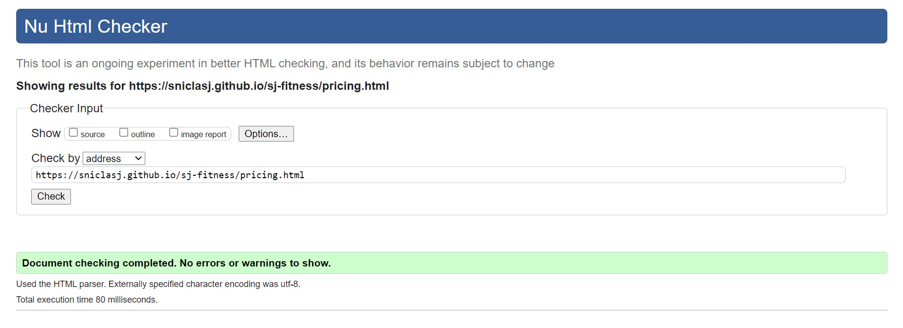

- CSS
  - No errors or warnings were found on any page when passing through the official [(Jigsaw) validator](https://jigsaw.w3.org/css-validator/validator?uri=https%3A%2F%2Fsniclasj.github.io%2Fsj-fitness%2F&profile=css3svg&usermedium=all&warning=1&vextwarning=&lang=en).
  - The screenshots of the result is below.
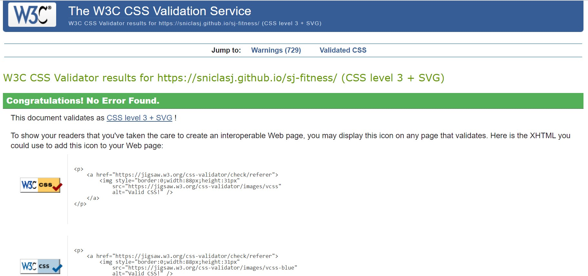

### Lighthouse

  - Mobile Test Results: Home
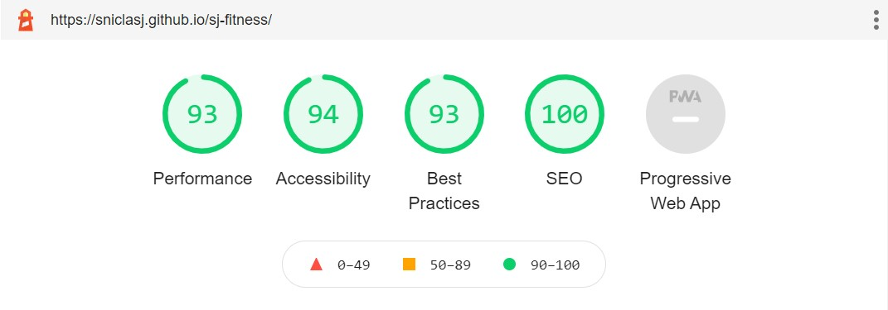
  - Mobile Test Results: Pricing
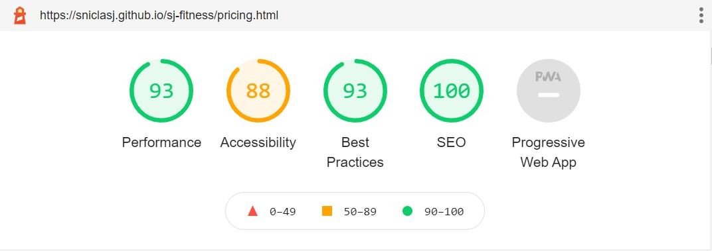
  - Mobile Test Results: Join Us
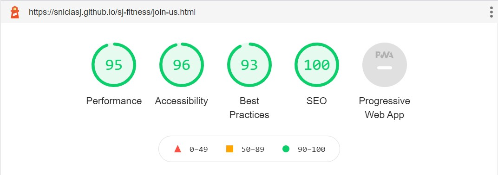
  - Desktop Test Results: Home
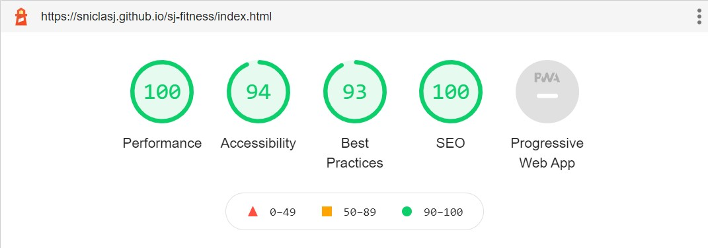
  - Desktop Test Results: Pricing
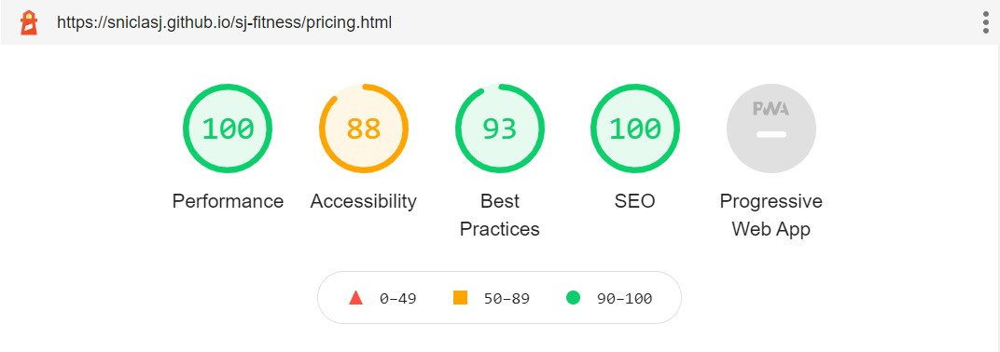
  - Desktop Test Results: Join Us

The issue highlighted in the Lighthouse testing is due to the contrast of text colour in relation to background colour on the pricing.html page. This is discussed in the Unfixed Bugs section below.

### Unfixed Bugs

- The only issue at present is the contrast issue on the pricing.html page. In order to completely address this, I could modify the colour theme of the website to increase the contrast ratio. To partially rectify this issue, I have added text shadowing to the text style so that the text is more visible/readable.

## Deployment

- The site was deployed to GitHub pages. The steps to deploy are as follows: 
  - In the GitHub repository, navigate to the Settings tab 
  - From the source section drop-down menu, select the Master Branch
  - Once the master branch has been selected, the page will be automatically refreshed with a detailed ribbon display to indicate the successful deployment. 

The live link can be found here - [SJ Fitness](https://sniclasj.github.io/sj-fitness/)

## Credits 

### Content 

- I utilised and modified the following code to create a placeholder for my dropdown list on the Join Us page: (https://stackoverflow.com/questions/5805059/how-do-i-make-a-placeholder-for-a-select-box).
- I populated the 'action' section of my form with the following URL: (https://formdump.codeinstitute.net).

### Media

- The photo used on the landing/home page was taken from: (https://simplifaster.com/articles/weightlifting-progressions-tall-long-limbed-athletes/).
- The icons used for the Pricing tiers and for the social media icons in the footer were taken from [Font Awesome](https://fontawesome.com/)
- The video used on the Join Us page is from: (https://www.pexels.com/video/silhouette-of-friends-doing-high-five-8692158/)

### Acknowledgements

- I would like to thank my Code Institute mentor Tim Nelson for his support during the course of this project.