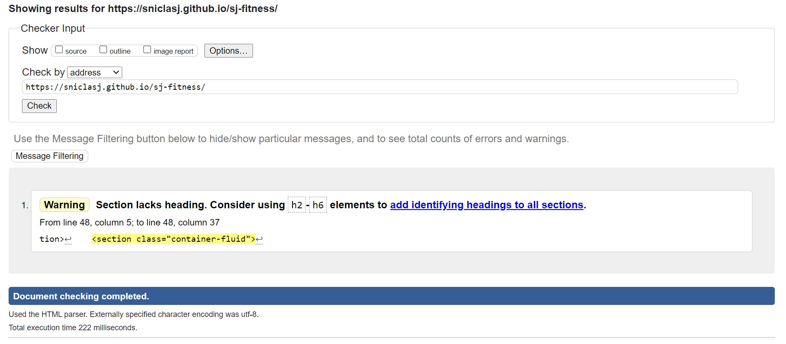
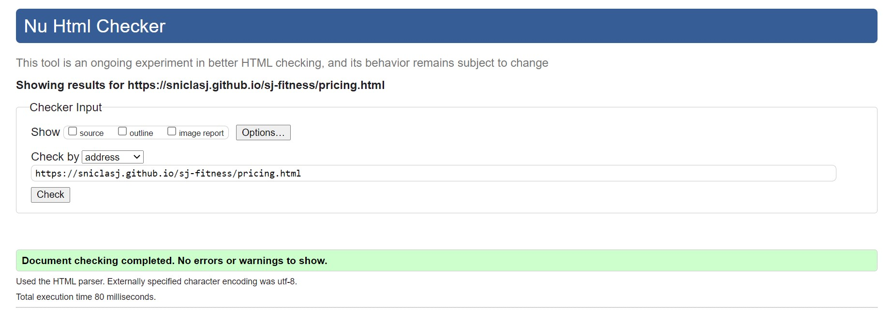
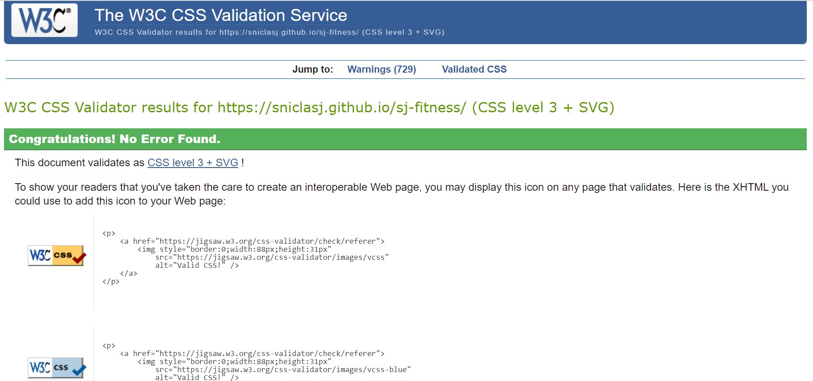
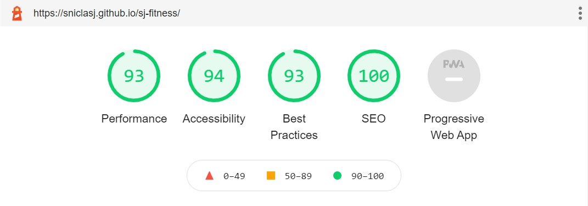
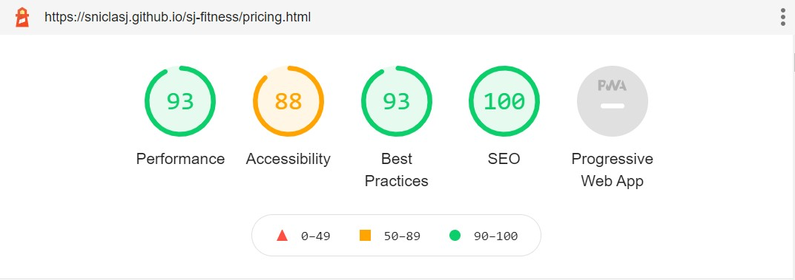
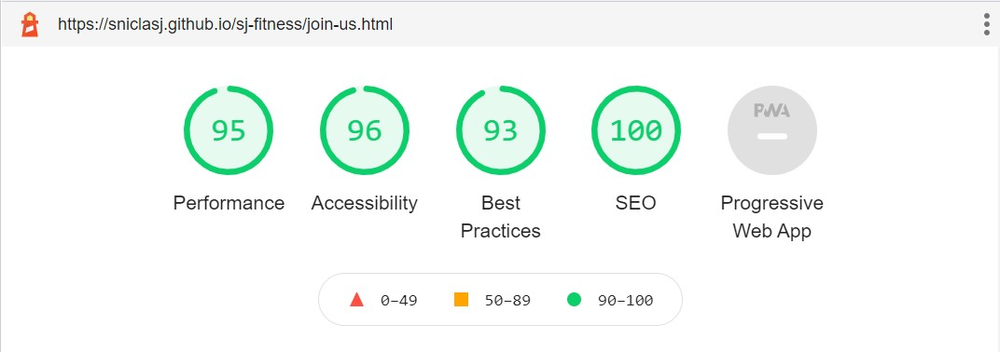
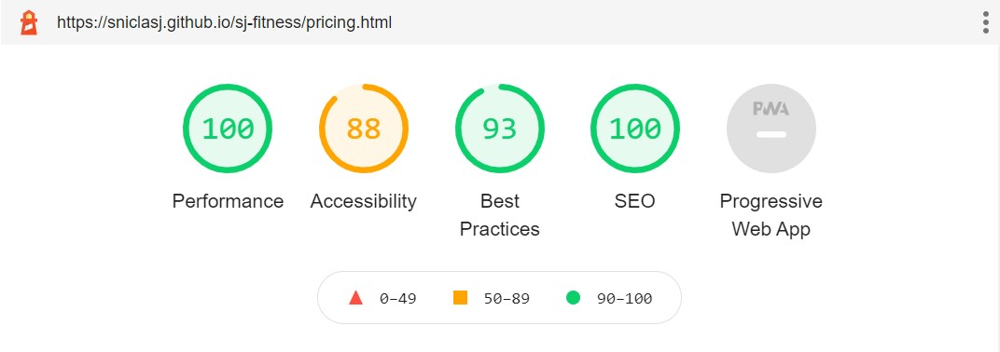

# Testing
## Screen Size Testing

### Responsiveness
- X

### Browser Compatibility
- X

- Chrome DevTools has been used to inspect the website. The window size has been responsively adjusted to inspect how the website performs at different screen sizes. The website works as planned as once the screen size goes beyond the breakpoint as defined by bootstrap for a medium sized device, any columns/page elements that would be adjacent to each other on a large screen stack on top of each other as desired.

## Validator Testing 

- HTML
  - No errors were returned on any page when passing through the official W3C Validator as shown in the links below.
  - [W3C Validator Home](https://validator.w3.org/nu/?doc=https://sniclasj.github.io/sj-fitness/index.html)
  - [W3C Validator Pricing](https://validator.w3.org/nu/?doc=https://sniclasj.github.io/sj-fitness/pricing.html)
  - [W3C Validator Join-Us](https://validator.w3.org/nu/?doc=https://sniclasj.github.io/sj-fitness/join-us.html)
  
  However, the following warnings were highlighted on the Home page and the Join-Us page due to the absence of a heading (h2 to h6) in a section in both instances.

  - The Home page warning is related to the hero image section missing a h2 to h6 heading. The reason for this is that the section is specifically there to create the space for the 'hero-image' on the home page therefore a heading would not be suitable in this instance.
  - The Join Us page warnings are also due to the absence of a heading (h2 to h6) for the sections used to create space for the 'join us' form and for the looped video. Again, a heading would not be appropriate in these instances which is why they have been omitted.

  - The Pricing page did not return any errors or warnings as shown in the below screenshot.
  

- CSS
  - No errors or warnings were found on any page when passing through the official [(Jigsaw) validator](https://jigsaw.w3.org/css-validator/validator?uri=https%3A%2F%2Fsniclasj.github.io%2Fsj-fitness%2F&profile=css3svg&usermedium=all&warning=1&vextwarning=&lang=en).
  - The screenshots of the result is below.

### Lighthouse

  - Mobile Test Results: Home

  - Mobile Test Results: Pricing

  - Mobile Test Results: Join Us

  - Desktop Test Results: Home

  - Desktop Test Results: Pricing

  - Desktop Test Results: Join Us

The issue highlighted in the Lighthouse testing is due to the contrast of text colour in relation to background colour on the pricing.html page. This is discussed in the Unfixed Bugs section below.

### Unfixed Bugs

- The only issue at present is the contrast issue on the pricing.html page. In order to completely address this, I could modify the colour theme of the website to increase the contrast ratio. To partially rectify this issue, I have added text shadowing to the text style so that the text is more visible/readable.